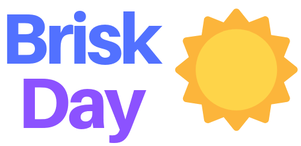

# BriskDay



BriskDay was developed as part of the Coder Academy GenTech JavaScript Hackathon from 23 September to 25 September 2019.

Simple in premise, BriskDay strives to be a simple yet beautiful dashboard page. It contains all the relevant information you will need to start off your day; these include the time, latest news headlines and weather.

## Getting Started

To get started, simply navigate to the directory in which you would like to store BriskDay and enter the following command into your terminal:
```bash
git clone git@github.com:t-hnh10/BriskDay.git
```
Following this command, please navigate to the root of the application and open `index.html` in your preferred browser.

## Tech Stack

* HTML
* CSS
* JavaScript

## Authors

* **Mark Ying** - *OpenWeather API Integration* - [kkk987](https://github.com/kkk987)
* **Tony Huynh** - *JavaScript Time Function, The Guardian API Integration & CSS Styling* - [t-hnh10](https://github.com/t-hnh10)

## License

This project is licensed under the GNU General Public License - see the [LICENSE.md](LICENSE.md) file for details.

## Acknowledgments

We wish to give thanks to the educators at [Coder Academy](https://coderacademy.edu.au/) for their ongoing support in the development of this product.

The background image was sourced from [Pixabay](https://pixabay.com/), home of many high quality, royalty free stock photos.